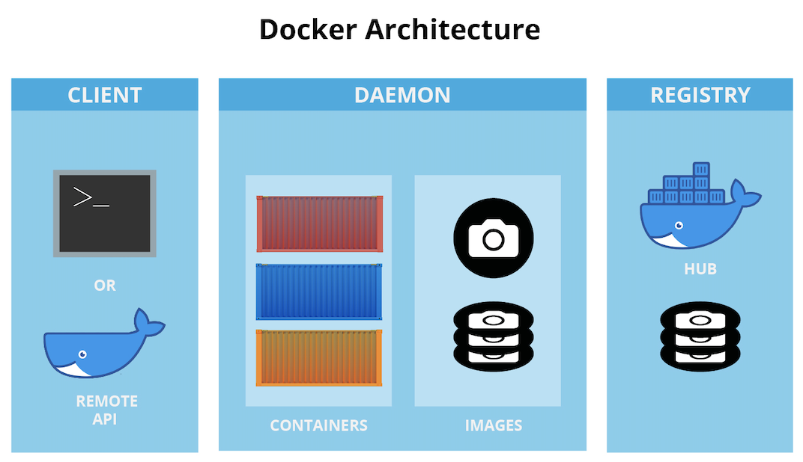
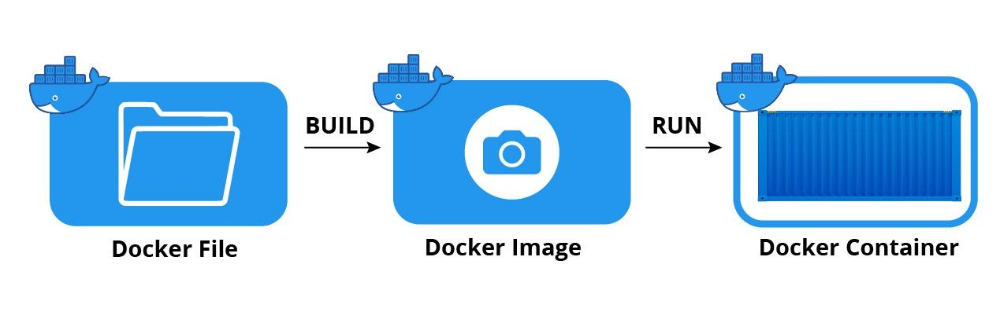

# Docker Workshop: Deploying Frontend, Backend, and Database

## Table of Contents

1. [Introduction](#introduction)
   1. [What is Docker?](#what-is-docker)
   2. [Why Use Docker?](#why-use-docker)
   3. [Key Concepts](#key-concepts)
   4. [Docker vs. Virtual Machines (VMs)](#docker-vs-virtual-machines-vms)
2. [Prerequisites](#prerequisites)
3. [Environment Setup](#environment-setup)
4. [Contextualization of the application](#contextualization-of-the-application)
5. [Deploying Frontend](#deploying-frontend)
6. [Deploying Backend and Database](#deploying-backend-and-database)
7. [Adittional Resources](#adittional-resources)

I hope this table of contents helps you organize your README file.

## Introduction

Welcome to this basic Docker workshop! In this workshop, we'll learn how to use Docker to deploy a frontend application, a backend service, and a database. We'll use a simple Node.js application and MongoDB as examples. With this workshop, you'll learn how to use Docker Compose to deploy multiple services at once and be able to contenerize your own applications.

Here you'll find the oficial documentation for **_docker_** and **_docker-compose_** and the get started:

- [Official Docker Documentation](https://docs.docker.com/)
- [Official Docker Compose Documentation](https://docs.docker.com/compose/)
- [Get Started with Docker](https://docs.docker.com/get-started/)

### What is Docker?

Docker is a platform that allows developers to **create, deploy, and run applications in containers**.
A container is like a lightweight, standalone executable software package that contains everything required to run a piece of software, including the code, runtime, system libraries, and settings. Containers are isolated from each other and the host system, but can communicate with each other through well-defined channels.

### Why Use Docker?

- **Consistency:** Containers ensure that applications run the same regardless of where they are.
- **Isolation:** Containers encapsulate the application and its environment. This reduces conflicts between different applications.
- **Portability:** Easily share and replicate environments across different stages of development.
- **Efficiency:** Containers are lightweight compared to traditional VMs, making it possible to run many more containers on a host machine than if using VMs.
- **Microservices:** Docker is conducive to the microservices architecture, where applications are broken down into small, independent services that run in their own containers.
  

### Key Concepts

- **Image:** A blueprint for a container, somewhat analogous to a class in OOP (Object-Oriented Programming). Images are built from a set of instructions written in a Dockerfile.
- **Container:** An instance of an image, analogous to an object in OOP. You can run, start, stop, move, or delete a container using the Docker API or CLI.
- **Docker Hub:** A cloud-based registry service where you can link to code repositories, build your images, and push them.
- **Dockerfile:** A script with a set of instructions to create an image.
- **Docker Compose:** A tool for defining and running multi-container Docker applications. With Compose, you use a YAML file to configure your application's services, networks, and volumes.

As Shown in the following image to build a container we need to create a Dockerfile, or use an existing one from Docker Hub (Registry equivalent to GitHub for Docker images) this file contains the instructions to build the image. Once we have the image we can run it and create a container.



### Docker vs. Virtual Machines (VMs)

- **Architecture:** VMs include the application, the necessary binaries and libraries, and an entire guest OS. Docker containers include the application and its dependencies but share the same OS kernel.
- **Size:** Docker containers are often much smaller than VMs.
- **Speed:** Containers can start almost instantly, whereas VMs can take minutes.
- **Density:** You can run more containers on a host machine than VMs.

## Prerequisites

1. Docker installed: [Get Docker](https://docs.docker.com/get-docker/)
2. Docker Compose installed (usually comes with Docker Desktop): [About Docker Compose](https://docs.docker.com/compose/)
3. Basic knowledge of Node.js and MongoDB is beneficial.

## Environment Setup

Make sure you have Docker and Docker Compose installed. You can check if you have Docker installed by running the following command:

```bash
docker --version
```

You should see something like this (Depending on when you are doing this workshop, the version might be different):

```bash
Docker version 19.03.5, build 633a0ea
```

You can check if you have Docker Compose installed by running the following command:

```bash
docker-compose --version
```

You should see something like this (Depending on when you are doing this workshop, the version might be different):

```bash
docker-compose version 1.25.4, build 8d51620a
```

If you don't have Docker or Docker Compose installed, please follow the links in the [Prerequisites](#prerequisites) section.

## Contextualization of the application

In this workshop we are going to deploy a simple application that has a frontend, a backend and a database.

- The **_frontend_** is a simple web page that allows us to create, read, update and delete users. We can find the frontend inside the **_todo-list-frontend_** folder.

- The **_backend_** is a simple REST API that allows us to perform CRUD operations on users. The database is a MongoDB database that stores the users. We can find the frontend inside the **_todo-list-backend_** folder.

- The **_database_** is a MongoDB database. Instead of using mongo atlas to host this service, we are going to use a docker container to host the database.

## Deploying Frontend

To deploy the frontend we need to create a Dockerfile, this file contains the instructions to build the image. Once we have the image we can run it and create a container.

1. When creating a Dockerfile we need to first specify the base image. Since we are using a React.js application we are going to use the **_node image_**. To do so we need to specify the image name and the version we are going to use. We are going to use the **_node:14-alpine_** image, this image is a lightweight version of node 14 (Since the used project was developed in this version).

> > When chossing node images we have a huge variety of options, we can find the official node images in the following link: [Node Docker Hub](https://hub.docker.com/_/node). As you can see in the link we have a lot of options, we can choose the version of node we want to use, the operating system, the size of the image, etc. And even if we don't find the image we want we can create our own image and upload it to Docker Hub. Now that we are learning the basics we won't pay to much attention on optimizing the selction of the base images, but in more advanced environments it's important to choose the right base images.

> > If you want to learn more about how to create your own images you can check the following link: [Create your own image](https://docs.docker.com/develop/develop-images/baseimages/)

```Dockerfile
# Create DockerFile in the root of the project - todo-list-frontend/Dockerfile

# Selecting Base image
FROM node:14-alpine
.
.
.

```

2. Now that we have our base image we need to specify the working directory. The working directory is the directory where the application will be installed inside of our container. To do so we need to use the **_WORKDIR_** instruction. Usually by standard we use the **_/app_** directory as the working directory.

```Dockerfile
# Create DockerFile in the root of the project - todo-list-frontend/Dockerfile

# Selecting Base image
FROM node:14-alpine

# Set the working directory
WORKDIR /app
.
.
.
```

3. Now that we have our working directory we need to copy the files from our local machine to the container. To do so we need to use the **_COPY_** instruction. The **_COPY_** instruction takes two parameters, the first one is the path to the file or folder we want to copy from our **local machine**, and the second one is the path to the file or folder we want to copy to **inside of our container**. In this case we are going to copy the **_package.json_** and **_package-lock.json_** files to the **_/app_** directory inside of our container. And after that we are going to run the **_yarn install_** command to install the dependencies of our application.

```Dockerfile
# Create DockerFile in the root of the project - todo-list-frontend/Dockerfile

# Selecting Base image
FROM node:14-alpine

# Set the working directory
WORKDIR /app

# Copy package.json and yarn.lock
COPY package.json yarn.lock ./

# Install dependencies
RUN yarn install --frozen-lockfile

.
.
.
```

4. Now that we have our dependencies installed we need to copy the rest of the files from our local machine to the container. To do so we need to use the **_COPY_** instruction. The **_COPY_** instruction takes two parameters, the first one is the path to the file or folder we want to copy from our **local machine**, and the second one is the path to the file or folder we want to copy to **inside of our container**. In this case we are going to copy the rest of the files to the **_/app_** directory inside of our container.

```Dockerfile
# Create DockerFile in the root of the project - todo-list-frontend/Dockerfile

# Selecting Base image
FROM node:14-alpine

# Set the working directory
WORKDIR /app

# Copy package.json and yarn.lock
COPY package.json yarn.lock ./

# Install dependencies
RUN yarn install --frozen-lockfile

# Copy the rest of the application code
COPY . .
.
.
.
```

5. Now that we have our application code inside of our container we need to build our application. To do so we need to use the **_RUN_** instruction. The **_RUN_** instruction takes a command as a parameter and executes it inside of our container. In this case we are going to run the **_yarn build_** command to build our application.

```Dockerfile
# Create DockerFile in the root of the project - todo-list-frontend/Dockerfile

# Selecting Base image
FROM node:14-alpine

# Set the working directory
WORKDIR /app

# Copy package.json and yarn.lock
COPY package.json yarn.lock ./

# Install dependencies
RUN yarn install --frozen-lockfile

# Copy the rest of the application code
COPY . .

# Build the frontend app
RUN yarn build
.
.
.
```

6. We need to set the environment variables for our application. To do so we need to use the **_ENV_** instruction. The **_ENV_** instruction takes two parameters, the first one is the name of the environment variable and the second one is the value of the environment variable. In this case we are going to set the **_VITE_FIREBASE_API_KEY_** variables.

```Dockerfile
# Create DockerFile in the root of the project - todo-list-frontend/Dockerfile

# Selecting Base image
FROM node:14-alpine

# Set the working directory
WORKDIR /app

# Copy package.json and yarn.lock
COPY package.json yarn.lock ./

# Install dependencies
RUN yarn install --frozen-lockfile

# Copy the rest of the application code
COPY . .

# Build the frontend app
RUN yarn build

# Set the environment variables with yout firebase credentials
ENV VITE_FIREBASE_API_KEY=YOU_SHOULD_COPY_HERE_YOUR_KEYS
ENV VITE_FIREBASE_DOMAIN=YOU_SHOULD_COPY_HERE_YOUR_KEYS
ENV VITE_FIREBASE_PROJECT_ID=YOU_SHOULD_COPY_HERE_YOUR_KEYS
ENV VITE_FIREBASE_STORAGE=YOU_SHOULD_COPY_HERE_YOUR_KEYS
ENV VITE_FIREBASE_MESSAGING=YOU_SHOULD_COPY_HERE_YOUR_KEYS
ENV VITE_FIREBASE_APP_ID=YOU_SHOULD_COPY_HERE_YOUR_KEYS
.
.
.
```

7. Now that we have our aplication we want to expose it to the outside world. To do so we need to use the **_EXPOSE_** instruction. The **_EXPOSE_** instruction takes a port as a parameter and exposes that port to the outside world. In this case we are going to expose the port **_5173_**. After that we need to specify the command we want to run when we start our container. To do so we need to use the **_CMD_** instruction. The **_CMD_** instruction takes a command as a parameter and executes it inside of our container. In this case we are going to run the **_yarn dev_** command to start our application.

```Dockerfile
# Create DockerFile in the root of the project - todo-list-frontend/Dockerfile

# Selecting Base image
FROM node:14-alpine

# Set the working directory
WORKDIR /app

# Copy package.json and yarn.lock
COPY package.json yarn.lock ./

# Install dependencies
RUN yarn install --frozen-lockfile

# Copy the rest of the application code
COPY . .

# Build the frontend app
RUN yarn build

# Set the environment variables with yout firebase credentials
ENV VITE_FIREBASE_API_KEY=YOU_SHOULD_COPY_HERE_YOUR_KEYS
ENV VITE_FIREBASE_DOMAIN=YOU_SHOULD_COPY_HERE_YOUR_KEYS
ENV VITE_FIREBASE_PROJECT_ID=YOU_SHOULD_COPY_HERE_YOUR_KEYS
ENV VITE_FIREBASE_STORAGE=YOU_SHOULD_COPY_HERE_YOUR_KEYS
ENV VITE_FIREBASE_MESSAGING=YOU_SHOULD_COPY_HERE_YOUR_KEYS
ENV VITE_FIREBASE_APP_ID=YOU_SHOULD_COPY_HERE_YOUR_KEYS

# Expose the port on which the app will run
EXPOSE 5173

# Run the frontend app
CMD ["yarn", "dev"]
```

Now that we have our Dockerfile we can build our image. To do so we need to run the following command inside **_/todo-list-frontend_** folder:

```bash
docker build -t todo-list-frontend .
```

> > The **_-t_** flag is used to tag our image. The tag is used to identify our image, in this case we are going to use the **_todo-list-frontend_** tag.

You should see something like this in the terminal:

```bash
    [+] Building 85.4s (12/12) FINISHED

        => [internal] load build definition from Dockerfile 0.1s
        => => transferring dockerfile: 822B 0.0s
        => [internal] load .dockerignore 0.1s
        => => transferring context: 2B 0.0s
        => [internal] load metadata for docker.io/library/node:14-alpine 2.7s
        => [auth] library/node:pull token for registry-1.docker.io 0.0s
        => [1/6] FROM docker.io/library/node:14-alpine@sha256:434215b487a329c9e867202ff89e704d3a75e554822e07f3e0c0f9e606121b33 0.0s
        => [internal] load build context 27.6s
        => => transferring context: 237.24MB 27.4s
        => CACHED [2/6] WORKDIR /app 0.0s
        => CACHED [3/6] COPY package.json yarn.lock ./ 0.0s
        => CACHED [4/6] RUN yarn install --frozen-lockfile 0.0s
        => [5/6] COPY . . 21.1s
        => [6/6] RUN yarn build 25.0s
        => exporting to image 8.6s
        => => exporting layers 8.6s
        => => writing image sha256:51a93c447767fd2fed15b2489550d82d3c3ed58849df6b8c801ea1a1c1ec2067 0.0s
        => => naming to docker.io/library/todo-list-frontend 0.0s
```

And to run our container we need to run the following command:

```bash
docker run -p 5173:5173 todo-list-frontend
```

As you can see in the command we are using the **_-p_** flag to map the port **_5173_** of our container to the port **_5173_** of our local machine. This is necessary to expose our application to the outside world.

We are ready to display our app. Go to the browser and type the following url: **_http://localhost:5173_**. You should see the app. If you try to interact with it you'll see we are getting some errors. That's because we haven't deployed the backend nor the database yet. We'll do that in the next sections.

## Deploying Backend and Database

To deploy the backend is basically the same steps but in this part of the workshop it's worth talking about the **_docker-compose_** file. The **_docker-compose_** file is a file that allows us to deploy multiple services at once. In this case we are going to deploy the backend and the database at once. To do so we need to create a **_docker-compose.yml_** file in the root of our project. The **_docker-compose.yml_** file is a YAML file that contains the configuration of our services. In this case we are going to deploy two services, the backend and the database. The **_docker-compose.yml_** file is divided in three sections, the **_version_** section, the **_services_** section and the **_volumes_** section. In the **_version_** section we specify the version of the **_docker-compose_** file we are using. In the **_services_** section we specify the services we want to deploy. And in the **_volumes_** section we specify the volumes we want to use. In this case we are going to use the **_volumes_** section to persist the data of our database. Let's start by creating the **_docker-compose.yml_** file.

1. Create a Dockerfile with the same steps as for the frontend. You can find the Dockerfile in the **_/todo-list-backend_** folder.

```Dockerfile
# Create DockerFile in the root of the project - todo-list-backend/Dockerfile

# Base image
FROM node:14-alpine

# Set the working directory
WORKDIR /app

# Copy package.json and yarn.lock
COPY package.json yarn.lock ./

# Install dependencies
RUN yarn install --frozen-lockfile

# Copy the rest of the application code
COPY . .

# Expose the port on which the app will run
EXPOSE 5000

# Start the app with nodemon
CMD ["yarn", "dev"]
```

2. Now we can create the docker-compose file. To do so we need to create a **_docker-compose.yml_** file in the root of our project. The **_docker-compose.yml_** file is a YAML file that contains the configuration of our services. In this case we are going to deploy two services, the backend and the database. The **_docker-compose.yml_** file is divided in three sections, the **_version_** section, the **_services_** section and the **_volumes_** section. In the **_version_** section we specify the version of the **_docker-compose_** file we are using. In the **_services_** section we specify the services we want to deploy. And in the **_volumes_** section we specify the volumes we want to use. In this case we are going to use the **_volumes_** section to persist the data of our database. Let's start by creating the **_docker-compose.yml_** file.

```yml
# Create docker-compose.yml in the root of the project - docker-compose.yml
version: '3'

services:
  mongo:
    image: mongo:latest
    ports:
      - 27017:27017
    volumes:
      - ./data:/data/db

  app:
    build:
      context: .
      dockerfile: Dockerfile
    ports:
      - 5000:5000
    volumes:
      - .:/app
      - /app/node_modules
    environment:
      - MONGO_URI=mongodb://mongo:27017/mydatabase
    depends_on:
      - mongo
```

As we can see we are getting the **_mongo_** image from Docker Hub. We are mapping the port **_27017_** of our container to the port **_27017_** of our local machine. And we are using the **_volumes_** section to persist the data of our database.

3. Now that we have our **_docker-compose.yml_** file we can deploy our services. To do so we need to run the following command in the root of our project inside **_todo-list-backend_** folder:

```bash
docker-compose up
```

And now we are ready to fully use hour app. We need to have the frontend running and the backend running.

## Adittional Resources

[Docker tutorial For Beginners](https://www.youtube.com/watch?v=fqMOX6JJhGo&ab_channel=TechWorldwithNana)
[Docker tutorial Español](https://www.youtube.com/watch?v=CV_Uf3Dq-EU&ab_channel=PeladoNerd)
[Best practises for Dockerfile](https://docs.docker.com/develop/develop-images/dockerfile_best-practices/)
